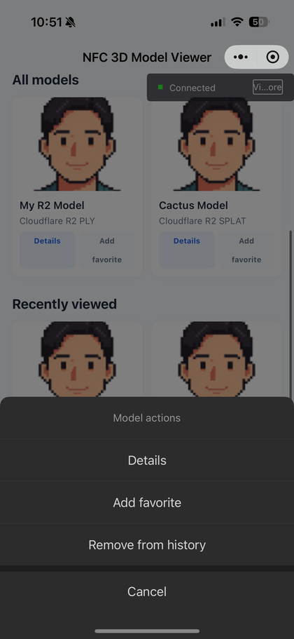
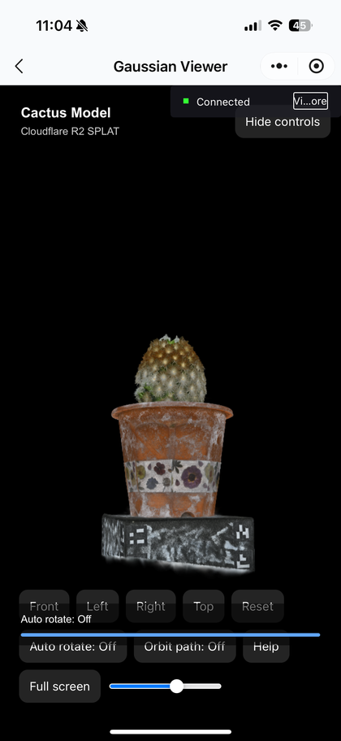
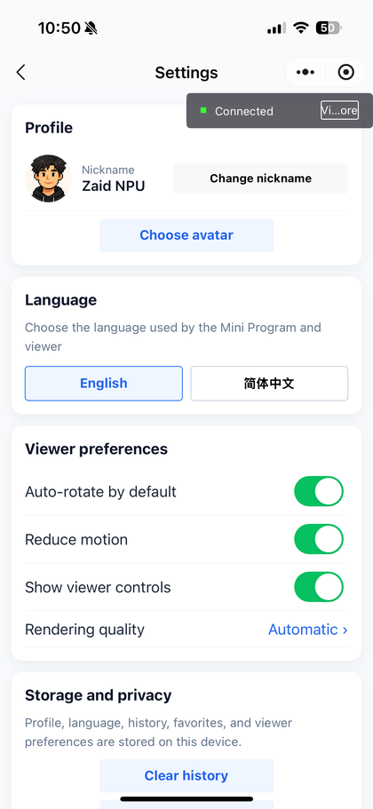
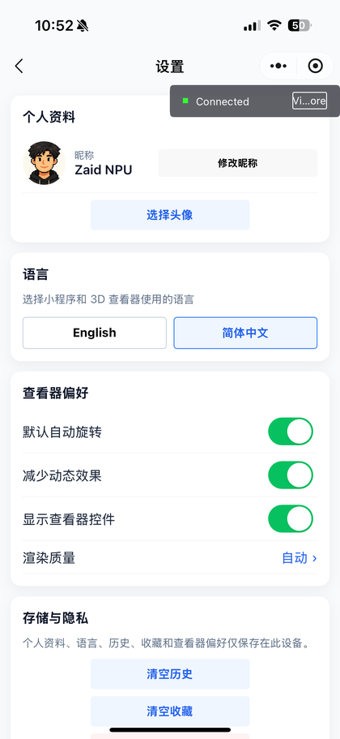
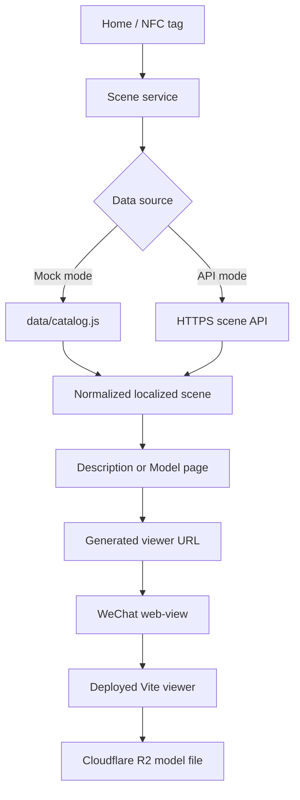

# NFC 3D Model Viewer

<p align="center">
  <strong>A bilingual WeChat Mini Program for opening interactive Gaussian splat models from a catalog or an NFC tag.</strong>
</p>

<p align="center">
  English · 简体中文 · NFC · Three.js · Gaussian Splats · WeChat Mini Program
</p>

The project combines a native WeChat Mini Program with a separately deployed WebGL viewer. Users can discover models, inspect their descriptions, save favorites, review history, scan an NFC tag, and interact with PLY, SPLAT, or KSPLAT scenes on a phone.

## Preview

<p align="center">
  
  &nbsp;
  
</p>

<p align="center">
  
  &nbsp;
  
</p>

> The screenshots are stored in [`documentation/images`](./documentation/images). They show the Mini Program running on a physical phone and may include the WeChat remote-debug overlay.

## Why this project exists

The goal is to connect physical objects with interactive 3D content. An NFC identifier resolves to a scene, and the Mini Program opens a mobile viewer where the user can rotate, zoom, pan, and inspect the model.

WeChat pages handle native product features, while a hosted website handles WebGL rendering. This keeps the Mini Program package below its size limit and lets the 3D viewer use established browser libraries.

## Main features

### Discovery and library

- Search localized model titles, subtitles, descriptions, and tags.
- Browse all models, recently viewed models, and favorites.
- Open a model directly or visit a separate description page first.
- Add or remove favorites from Home, Details, Viewer, or Favorites.
- Long-press a Home card for an ordered action sheet:
  1. View description
  2. Add or remove favorite
  3. Remove from history when the item is in Recent
- Clear history, clear favorites, or reset all local data.

### NFC flow

- Detects whether the current WeChat environment supports HCE.
- Checks the WeChat SDK version before starting NFC.
- Accepts a direct `sceneId`, direct `nfcId`, UTF-8 JSON payload, or plain NFC ID.
- Normalizes NFC IDs and resolves them through the local catalog or API.
- Prevents duplicate NFC messages from opening the same scene repeatedly.
- Stops NFC and removes listeners when the page hides or unloads.

### Bilingual interface

- Complete English and Simplified Chinese dictionaries.
- Initial language detection from WeChat/device settings.
- Persistent explicit language selection in Settings.
- Localized navigation titles, tab labels, messages, errors, and scene metadata.
- Language is passed to the hosted viewer so both interfaces remain synchronized.

### Settings and profile

- Nickname and avatar selection.
- English/Chinese language preference.
- Auto-rotate, reduced motion, controls visibility, and rendering quality preferences.
- Storage/privacy controls.
- Mini Program version, supported formats, viewer technology, and support information.

### 3D viewer

- PLY, SPLAT, and KSPLAT Gaussian-scene loading.
- Orbit, zoom, and pan gestures.
- Front, left, right, top, and reset camera presets.
- Auto-rotate and scripted orbit controls with visible active states.
- Camera-distance slider.
- Staged initialization and model-loading status.
- Bilingual help and viewer controls.
- Fullscreen API with an immersive fallback for restricted WeChat WebViews.
- Performance, automatic, and high-quality pixel-ratio modes.
- Reduced-motion startup behavior.
- Rendering pause while the browser document is hidden.
- Viewer-to-Mini-Program ready, error, camera, and preset messages.

## Architecture



The Mini Program does **not** run `viewer/` from local files on a phone. It loads the deployed URL configured by `viewerBase`.

## Technology

| Layer | Technology |
| --- | --- |
| Mobile application | WeChat Mini Program, WXML, WXSS, JavaScript |
| Embedded viewer | WeChat `<web-view>` |
| Web application | Vite |
| 3D rendering | Three.js |
| Gaussian splats | `@mkkellogg/gaussian-splats-3d` |
| Current viewer host | Vercel |
| Current model storage | Cloudflare R2 |
| Local persistence | WeChat synchronous storage |
| Supported languages | English and Simplified Chinese |

## Repository structure

```text
NFC_V1/
├── app.js / app.json / app.wxss
├── config/
│   └── index.js                 # Deployment values and defaults
├── data/
│   └── catalog.js               # Local bilingual scene catalog
├── pages/
│   ├── index/                   # Home, search, NFC, and quick actions
│   ├── description/             # Localized model information
│   ├── model/                   # Embedded viewer page
│   ├── history/                 # Browsing history
│   ├── favorite/                # Saved favorites
│   └── settings/                # Profile, language, viewer, and storage settings
├── utils/
│   ├── locales/                 # English and Chinese dictionaries
│   ├── services/                # Scene, NFC, and local-library services
│   ├── viewer/                  # Viewer URL builder
│   ├── i18n.js                  # Localization service
│   ├── navigation.js            # Shared page routes
│   └── scene.js                 # Scene normalization
├── viewer/                      # Independently deployed Vite website
│   ├── src/main.js
│   ├── src/locales.js
│   └── package.json
├── tests/
│   └── smoke.js                 # Dependency-free behavior checks
└── documentation/               # Detailed guides and screenshots
```

## Getting started

### Requirements

- WeChat Developer Tools
- A valid WeChat Mini Program AppID
- Node.js and npm for viewer development
- A supported physical device for NFC verification
- HTTPS hosting for the viewer and model files

### Run the Mini Program

1. Clone or download the repository.
2. Open the repository root in WeChat Developer Tools.
3. Confirm the AppID in `project.config.json`.
4. Review deployment values in `config/index.js`.
5. Compile the Mini Program.
6. Use device preview or remote debugging for phone testing.

The desktop simulator can test pages and storage, but it cannot fully validate real NFC behavior.

### Run the viewer locally

```powershell
cd viewer
npm ci
npm run dev
```

Create a production bundle:

```powershell
cd viewer
npm run build
```

The generated `viewer/dist/` directory is local output. Building it does not update the phone experience until the viewer is redeployed.

## Deploy the viewer

Recommended Vercel configuration:

| Setting | Value |
| --- | --- |
| Root Directory | `viewer` |
| Install Command | `npm ci` |
| Build Command | `npm run build` |
| Output Directory | `dist` |

After deployment:

1. Copy the HTTPS deployment URL.
2. Set `viewerBase` in `config/index.js`.
3. Add the host to the permitted WeChat business-domain configuration.
4. Confirm that the deployed viewer can fetch every model URL through CORS.
5. Clear the Developer Tools cache and recompile if old viewer URLs remain cached.

The current configured viewer is:

```text
https://3dgs-miniapp2.vercel.app/
```

## Add or replace models

The default catalog is [`data/catalog.js`](./data/catalog.js). A typical entry looks like:

```js
{
  id: 'scene_003',
  sceneId: 'scene_003',
  nfcId: 'YOUR_NFC_ID',
  title: {
    en: 'Example Model',
    'zh-CN': '示例模型'
  },
  subtitle: {
    en: 'Short English subtitle',
    'zh-CN': '简短中文副标题'
  },
  description: {
    en: 'English model description',
    'zh-CN': '中文模型说明'
  },
  thumbnail: '/images/example.png',
  type: 'gaussian',
  format: 'splat',
  modelUrl: 'https://models.example.com/example.splat',
  rotationDeg: [180, 0, 0],
  minDistance: 1,
  maxDistance: 12,
  orbitSpeed: 1,
  cameraPreset: {
    target: [0, 1, 0],
    distance: 3
  },
  tags: ['example', 'splat'],
  active: true,
  sortOrder: 3
}
```

Plain strings remain supported for backward compatibility, but bilingual objects are recommended.

## Switch to a real API

Set `useMock: false` in `config/index.js`, configure `apiBase`, and implement:

```text
GET {apiBase}/api/scenes/{sceneId}
GET {apiBase}/api/scenes/by-nfc/{nfcId}
```

The API response should follow the catalog scene schema. Non-2xx and invalid responses are converted into localized application errors.

## Viewer URL contract

The Mini Program sends these query parameters to the deployed viewer:

- Scene: `sceneId`, `title`, `subtitle`, `type`, `format`, `modelUrl`
- Camera: `target`, `distance`, `rotationDeg`, `minDistance`, `maxDistance`, `orbitSpeed`
- Preferences: `lang`, `autoRotate`, `reducedMotion`, `showControls`, `quality`

Values are URL encoded by `utils/viewer/url-builder.js`.

## Testing

Run the repository smoke suite:

```powershell
node tests/smoke.js
```

It checks:

- All registered page files exist.
- History is deduplicated and removable.
- Favorites can be added and detected.
- NFC JSON and plain-text payloads are parsed correctly.
- English and Chinese dictionaries contain matching keys.
- Chinese scene localization works.
- Viewer URLs include language and saved preferences.
- Mini Program page modules load with a mocked WeChat environment.

Also run the viewer production build before deployment:

```powershell
cd viewer
npm run build
```

## Package size

The Mini Program upload excludes `viewer/`, `documentation/`, `tests/`, and Markdown files through `project.config.json`. These are development or separately deployed resources, not Mini Program runtime dependencies.

The runtime source is approximately 1.5 MB. Avatar images account for most of the package, so compress them before adding large bundled assets.

## Known platform considerations

- NFC must be tested on supported physical devices.
- The WeChat simulator does not fully represent HCE behavior.
- Browser fullscreen may be blocked inside WeChat; the viewer provides an immersive fallback.
- Viewer source changes require a new deployment.
- Model files require HTTPS and correct CORS configuration.
- Large Gaussian scenes can exceed the memory or GPU capability of older phones.
- The viewer bundle is large because it includes Three.js and Gaussian-splat rendering code.

## Detailed documentation

- [Project story](./documentation/01-project-story.md)
- [Architecture and runtime pipeline](./documentation/02-architecture-and-pipeline.md)
- [Web viewer and model handling](./documentation/03-web-viewer-and-models.md)
- [NFC, localization, and local storage](./documentation/04-nfc-data-and-library.md)
- [Setup, deployment, and testing](./documentation/05-setup-deployment-and-testing.md)

## Project ownership

This project is independently created and maintained by its owner.

<!-- Replace these placeholders after the owner provides the preferred public details. -->

- **Creator:** Your name
- **GitHub:** Your GitHub profile
- **Role:** Project creator and maintainer
- **Contact:** Optional public email or website

If you reuse or reference this work, please retain appropriate credit to the project owner.

## License

No public license has been selected yet. Unless a license file is added, the repository should be treated as all rights reserved by the project owner.
